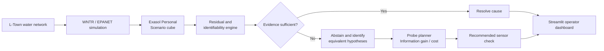
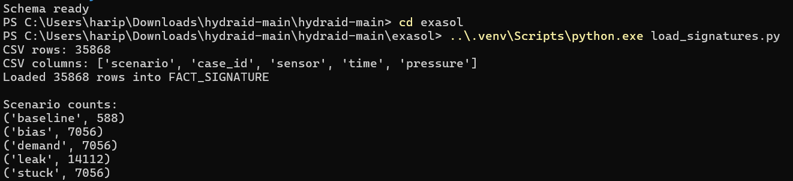
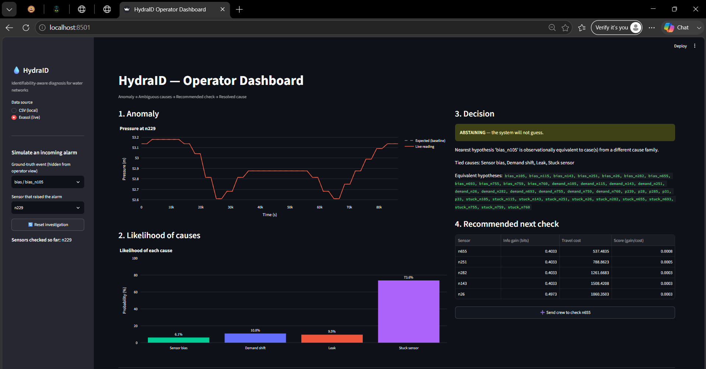

<div align="center">

# HydraID

### Identifiability-Aware Diagnosis for Water Distribution Networks

**An Exasol AI Build Challenge 2026 project**

[](https://github.com/haripriyasubbiah/hydraid)
[](https://www.exasol.com/)
[](LICENSE)

<br />

> **HydraID knows when the available evidence is not enough to identify a water-network fault, and recommends the next most useful check instead of guessing.**

<br />


<br /><br />

| Primary data platform |     Operator behaviour     |         Core output        |
| :-------------------: | :------------------------: | :------------------------: |
|  **Exasol Personal**  | **Abstain when uncertain** | **Best next sensor check** |

</div>

---

## The Problem

When a water utility receives an anomaly alert, the honest answer to “what caused this?” is often: **we cannot tell yet.**

A leak, sudden demand surge, sensor bias, and stuck sensor can look identical from only a few pressure readings. Many anomaly-detection systems still force a single answer, causing operators to chase false alarms or miss real leaks.

**HydraID does not guess when the available evidence is insufficient.**

## The Solution

HydraID is an operator-assistance system for water-distribution diagnosis. It:

1. Simulates signatures for possible fault families: leak, demand shift, sensor bias, and stuck sensor.
2. Stores the scenario cube in **Exasol Personal**.
3. Compares incoming readings against those known signatures.
4. Detects when multiple causes remain observationally equivalent.
5. Abstains rather than giving an unjustified diagnosis.
6. Recommends the next sensor check using expected information gain, travel cost, and risk.
7. Resolves the cause only when the evidence becomes distinguishable.

In short: *“I cannot yet tell whether this is a leak or a faulty sensor, but this is the next cheapest check that will help separate them.”*

## Why It Matters

Wrong maintenance decisions waste crew time, money, water, and potentially damage infrastructure. HydraID makes uncertainty visible and helps operators gather the most useful next piece of evidence instead of acting on a confident but unsupported prediction.

---

## Architecture



| Stage                  | Role in HydraID                                                      |
| ---------------------- | -------------------------------------------------------------------- |
| Simulation             | Generates baseline and fault signatures for the water network        |
| Exasol Personal        | Stores and serves the scenario-signature cube                        |
| Identifiability engine | Determines whether a diagnosis is supported by the observed evidence |
| Probe planner          | Ranks the next sensor check that best resolves ambiguity             |
| Dashboard              | Presents the reasoning process to the operator                       |

## Tech Stack

| Layer                         | Tools                                         |
| ----------------------------- | --------------------------------------------- |
| Hydraulic simulation          | Python, WNTR, EPANET                          |
| Primary data platform         | **Exasol Personal** running locally in Docker |
| Data processing and inference | NumPy, SciPy, pandas, scikit-learn            |
| Probe planning                | NetworkX                                      |
| Dashboard                     | Streamlit, Plotly                             |

## Data

HydraID uses the **BattLeDIM L-Town** water-distribution network, a realistic benchmark network with 782 junctions, 905 pipes, and 3 reservoirs.

The project uses 12 fixed pressure sensors:

```text
n26, n105, n115, n143, n229, n251,
n282, n655, n693, n755, n759, n760
```

The simulated scenario cube includes:

| Scenario     | Distinct cases |       Rows |
| ------------ | -------------: | ---------: |
| Baseline     |              1 |        588 |
| Leak         |             24 |     14,112 |
| Demand shift |             12 |      7,056 |
| Sensor bias  |             12 |      7,056 |
| Stuck sensor |             12 |      7,056 |
| **Total**    |                | **35,868** |

Each case contains a full 49-step pressure time series across all 12 sensors.

## How Exasol Personal Is Used

**Exasol Personal is HydraID’s primary data platform.**

The Docker-hosted Exasol database stores the simulated water-network scenario cube in:

```text
HYDRAID.FACT_SIGNATURE
```

This table stores simulated pressure signatures for every scenario, case, sensor, and time step. The Streamlit dashboard supports an **Exasol (live)** mode, which queries this table directly through `src/exasol_data.py`.

| Table              | Purpose                               |
| ------------------ | ------------------------------------- |
| `DIM_NETWORK`      | Physical network topology             |
| `DIM_SENSOR`       | Sensor metadata                       |
| `DIM_HYPOTHESIS`   | Candidate fault causes                |
| `FACT_SIGNATURE`   | Simulated scenario-signature cube     |
| `FACT_OBSERVATION` | Incoming or operator-entered readings |
| `FACT_POSTERIOR`   | Computed probabilities per hypothesis |
| `MART_PROBE_RANK`  | Ranked recommended sensor checks      |
| `AUDIT_RUN`        | Reproducibility and run log           |

---

## Verified Local Deployment with Exasol Personal

HydraID was successfully deployed locally on Windows using **Exasol Personal in Docker**.

### Deployment evidence

| Exasol scenario cube loaded                                                           | HydraID querying Exasol live                                                               |
| ------------------------------------------------------------------------------------- | ------------------------------------------------------------------------------------------ |
|  |  |

### 1. Start Exasol Personal

From the project root:

```powershell
docker compose -f exasol/docker-compose.yml up -d
```

### 2. Create the schema

Run the SQL in:

```text
exasol/schema.sql
```

This creates the `HYDRAID` schema and required tables.

### 3. Load the scenario cube

```powershell
cd exasol
..\.venv\Scripts\python.exe load_signatures.py
```

Expected result:

```text
Loaded 35868 rows into FACT_SIGNATURE
```

### 4. Launch HydraID

From the project root:

```powershell
$env:HYDRAID_EXASOL_DSN = "localhost:8563"
$env:HYDRAID_EXASOL_USER = "sys"
$env:HYDRAID_EXASOL_PASSWORD = "exasol"
$env:HYDRAID_EXASOL_SCHEMA = "HYDRAID"

.\.venv\Scripts\streamlit.exe run app\dashboard.py
```

Open:

```text
http://localhost:8501
```

Then select **Exasol (live)** from the sidebar.

---

## Setup Guide

### Prerequisites

* Docker Desktop
* Python 3.10 or newer
* Git

### Clone and install dependencies

```bash
git clone https://github.com/haripriyasubbiah/hydraid.git
cd hydraid

python -m venv .venv
```

Windows:

```powershell
.\.venv\Scripts\python.exe -m pip install --upgrade pip
.\.venv\Scripts\python.exe -m pip install -r requirement.txt
```

macOS/Linux:

```bash
source .venv/bin/activate
pip install -r requirement.txt
```

Then follow the deployment steps above to start Exasol, create the schema, load the data, and launch the dashboard.

---

# Final Submission Package

> **HydraID is submitted as a complete, reproducible Exasol Personal project.**
> This repository contains the source code, verified deployment evidence, pitch deck, run guide, and demo video.

<table>
<tr>
<td width="50%" valign="top">

### Included Deliverables

* [x] [Public source code repository](https://github.com/haripriyasubbiah/hydraid)
* [x] [Pitch deck](docs/pitch/HydraID_Deck.pptx)
* [x] [Local Exasol deployment guide](#verified-local-deployment-with-exasol-personal)
* [x] [Exasol load verification](docs/screenshots/exasol-load-success.png)
* [x] [Live Exasol dashboard evidence](docs/screenshots/exasol-live-probe-planner.png)
* [ ] [Demo video](https://drive.google.com/file/d/1YfcMG5ccOzoKNh1plwPMablGnPiSx9o7/view?usp=sharing)

</td>
<td width="50%" valign="top">

### Deployment Verification

| Check                    | Result                    |
| ------------------------ | ------------------------- |
| Exasol Personal database | Running locally in Docker |
| Primary scenario table   | `HYDRAID.FACT_SIGNATURE`  |
| Data loaded              | 35,868 rows               |
| Dashboard data source    | **Exasol (live)**         |
| Local dashboard URL      | `http://localhost:8501`   |

</td>
</tr>
</table>

> **Judge quick-start:** Follow the [Setup Guide](#setup-guide), start Exasol Personal, load `FACT_SIGNATURE`, and choose **Exasol (live)** in the dashboard sidebar.

---

## Demo Video

[Watch the HydraID demo](https://drive.google.com/file/d/1YfcMG5ccOzoKNh1plwPMablGnPiSx9o7/view?usp=sharing)

## Pitch Deck

[Download the HydraID pitch deck](docs/pitch/HydraID_Deck.pptx)

## Repository Structure

```text
hydraid/
├── app/                  # Streamlit dashboard
├── data/                 # L-Town network data and frozen scope definitions
├── docs/
│   ├── assets/           # README hero graphic
│   ├── pitch/            # Submission pitch deck
│   └── screenshots/      # Exasol deployment evidence
├── exasol/               # Docker Compose, schema, and loader
├── simulation/           # Fault injection and signature generation
├── src/                  # Inference, identifiability, probe planner, Exasol reader
├── tests/                # Evaluation scripts
├── signatures.csv        # Generated scenario cube data
└── requirement.txt       # Python dependencies
```

## Team

Built by a team of five for the Exasol AI Build Challenge 2026.

## License

MIT. See [LICENSE](LICENSE).
